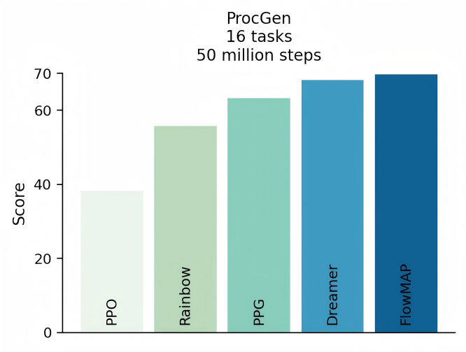
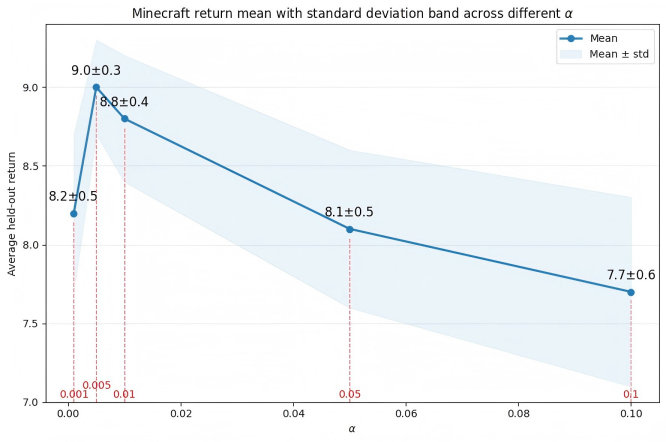
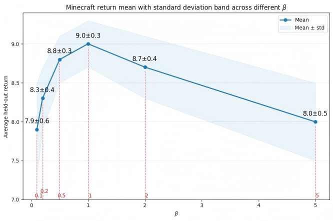
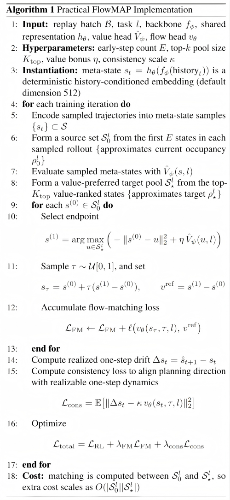

## Relevant ICML Policy

> **Anonymity and Links:** Your responses to reviewers should not contain or link to any identifying information that may violate the double-blind reviewing policy. While links are allowed, reviewers are not required to follow them, and links may only be used for figures (including tables) and captions that describe the figure (no additional text).

## Supplementary Figures for the Rebuttal

### Figure S1. ProcGen result (2 seeds)

*Caption:* ProcGen evaluation with **2 seeds** on 16 tasks at 50 million steps. This figure supplements the original 1-seed setting with a more reliable multi-seed evaluation, where FlowMAP remains competitive with the strongest baseline and stronger than the other RL baselines.

---

### Figure S2. ProcGen result (5 seeds)

*Caption:* ProcGen evaluation with **5 seeds** on 16 tasks at 50 million steps. This figure provides a higher-confidence multi-seed comparison than the original 1-seed plot, showing a more stable ranking in which FlowMAP remains competitive with, and slightly stronger than, the strongest baseline.

---

### Figure S3. Sensitivity analysis for the quantile filtering ratio $\alpha$

*Caption:* Minecraft episodic return under different values of the quantile filtering ratio $\alpha$. Performance is strongest near $\alpha=0.005$: smaller values weaken filtering, while larger values make the target set too selective and reduce robustness.

---

### Figure S4. Sensitivity analysis for the temperature parameter $\beta$

*Caption:* Minecraft episodic return under different values of the temperature parameter $\beta$. Performance is strongest around $\beta=1$, while both smaller and larger values reduce return, indicating a stable intermediate regime.

---

## Supplementary Tables

### Table S1. Atari 100k ablation results
*Caption:* Atari 100k ablation results. **HNS** denotes **human-normalized score**, the standard aggregate evaluation metric for Atari 100k. The full method performs best, while removing value-shaped transport and loss terms reduce performance.

| Method | Mean HNS | Median HNS | IQM HNS |
|---|---:|---:|---:|
| No Flow (RL only) | 101.2 | 49.5 | 62.1|
| RL + Cons only | 106.5 | 53.0 | 66.4 |
| Flow w/o Value Target | 95.8 | 52.4 | 60.5 |
| Pointwise Value Update | 115.3 | 55.2 | 70.4 |
| VTFM w/o Consistency | 125.0  | 51.0 | 68.5|
| Frozen Flow | 118.2 | 60.1 | 76.2  |
| Full FlowMAP | 127.4 | 65.8 | 85.3 |

---

### Table S2. BSuite ablation results

*Caption:* BSuite ablation results. Values are reported as mean episodic return averaged over tasks. The full method performs best, while removing value-shaped transport and loss terms reduce performance.

| Method | BSuite Mean Return |
|---|---:|
| No Flow (RL only) | 54.2 |
| RL + Cons only | 55.5 |
| Flow w/o Value Target | 53.8 |
| Pointwise Value Update | 61.3 |
| VTFM w/o Consistency | 57.8 |
| Frozen Flow | 65.2 |
| Full FlowMAP | 69.0 |

---

### Table S3. Computational-cost information

*Caption:* Benchmark-level computational-cost information for the supplementary experiments. Entries are reported as **FlowMAP vs DreamerV3** when the two differ; **a single value indicates that the two settings are the same.**

| Benchmark | Tasks | Replay Ratio | GPU Days (FlowMAP vs DreamerV3) | Model Size | Peak RAM Usage (GB) (FlowMAP vs DreamerV3) |
|---|---:|---:|---:|---:|---:|
| Minecraft | 1 | 32 | 1.5 vs 1.3 | 200M | 250 |
| DMLab | 30 | 32 | 0.5 vs 0.4 | 200M | 245 vs 240 |
| ProcGen | 16 | 32 | 1.2 vs 1.1 | 200M | 320 vs 317 |
| Atari | 57 | 32 | 0.9 vs 0.8 | 200M | 217 vs 210 |
| Atari 100k | 26 | 128 | 0.1 | 200M | 30 |
| BSuite | 23 | 1024 | 0.1 | 200M | 14 |
| DMC Vision Control| 20 | 256 | 0.3 | 200M | 95 vs 93 |
| DMC Proprio Control | 20 | 1024 | 0.4 vs 0.3 | 1M | 18 vs 17 |
---

### Table S4. Hardware configuration

*Caption:* Hardware used for the supplementary experiments. Unless otherwise noted, each run used a single GPU.

| Item | Value |
|---|---|
| GPU Model | NVIDIA RTX A6000 |
| Number of GPUs Available | 8 |
| GPU Memory per Card | 48 GB (49140 MiB reported) |
| CUDA Version | 12.2 |
| Driver Version | 535.288.01 |
| Per-Run GPU Usage | Single GPU |
| Total System RAM | 528 GB |

---

### Table S5. Benchmark-level dynamic heterogeneity (MDHI)

*Caption:* Benchmark-level dynamic heterogeneity measured in the same meta-state space used by FlowMAP. $H_{\mathrm{ctx}}$ denotes cross-context heterogeneity, $H_{\mathrm{temp}}$ denotes temporal non-stationarity, and $H(\mathcal{B})$ is their normalized average.

| Benchmark | $H_{\mathrm{ctx}}$ | $H_{\mathrm{temp}}$ | $H(\mathcal{B})$ |
|---|---:|---:|---:|
| ProcGen | 0.78 | 0.65 | 0.72 |
| Minecraft | 0.77 | 0.66 | 0.71 |
| Atari | 0.83 | 0.48 | 0.66 |
| DMLab | 0.41 | 0.37 | 0.39 |

---

### Figure S5. Practical FlowMAP implementation

*Caption:* Expanded operational version of Algorithm 1, showing the practical implementation of meta-state construction, endpoint matching, consistency alignment, and matching cost.
